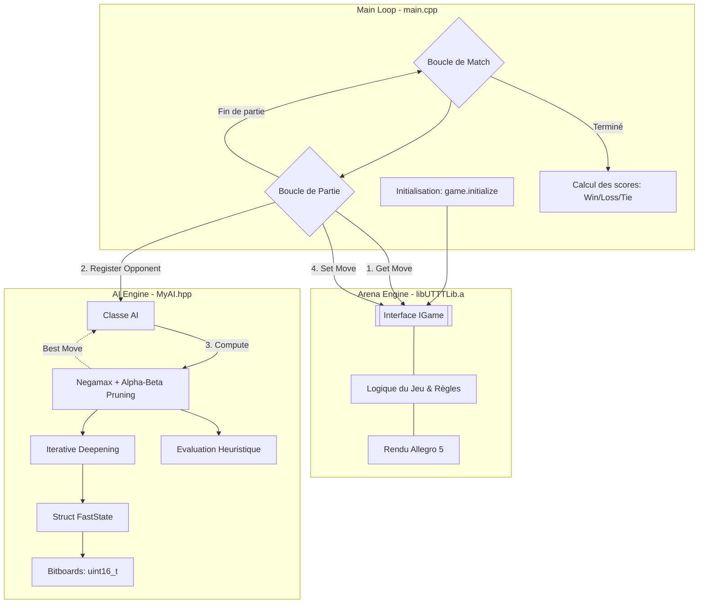

# Project Architecture Diagram

This diagram represents the functional architecture and data flow of the Ultimate Tic-Tac-Toe AI project.

```mermaid
flowchart TD
    subgraph Main_Loop [Main Loop - main.cpp]
        Init[Initialisation: game.initialize]
        M_Loop{Boucle de Match}
        G_Loop{Boucle de Partie}
        Stats[Calcul des scores: Win/Loss/Tie]
    end

    subgraph Arena [Arena Engine - libUTTTLib.a]
        IGame[[Interface IGame]]
        ArenaLogic[Logique du Jeu & Règles]
        Visuals[Rendu Allegro 5]
    end

    subgraph AI_Core [AI Engine - MyAI.hpp]
        AIClass[Classe AI]
        Search[Negamax + Alpha-Beta Pruning]
        ID[Iterative Deepening]
        FastState[Struct FastState]
        Bitboards[Bitboards: uint16_t]
        Heuristics[Evaluation Heuristique]
    end

    %% Connexions principales
    Init --> IGame
    M_Loop --> G_Loop
    G_Loop -->|1. Get Move| IGame
    G_Loop -->|2. Register Opponent| AIClass
    AIClass -->|3. Compute| Search
    
    %% Détails IA
    Search --> ID
    ID --> FastState
    FastState --> Bitboards
    Search --> Heuristics
    
    %% Retour et Finalisation
    Search -.->|Best Move| AIClass
    G_Loop -->|4. Set Move| IGame
    IGame --- ArenaLogic
    ArenaLogic --- Visuals
    
    G_Loop -->|Fin de partie| M_Loop
    M_Loop -->|Terminé| Stats
```
